SOLID is basically 5 principles, which will help to create a good software architecture.  
You can see that all design patterns are based on these principles. SOLID is basically an acronym of the following:

* **S** is single responsibility principle (SRP)
* **O** stands for open closed principle (OCP)
* **L** Liskov substitution principle (LSP)
* **I** interface segregation principle (ISP)
* **D** Dependency injection principle (DIP)

<h2>1.1 Single responsibility principle (SRP)</h2>

A class should take one responsibility and there should be one reason to change that class. Now what does that mean? I want to share one picture to give a clear idea about this.

Now see this tool is a combination of so many different tools like knife, nail cutter, screw driver, etc. So will you want to buy this tool?  
I don’t think so. Because there is a problem with this tool, if you want to add any other tool to it, then you need to change the base and that is not good.  
This is a bad architecture to introduce into any system. It will be better if nail cutter can only be used to cut the nail or knife can only be used to cut vegetables.

<b>'Employee'</b> class is taking 2 responsibilities, one is to take responsibility of employee database operation and another one is to generate employee report.    <b>Employee</b> class should not take the report generation responsibility because suppose some days after your customer asked you to give a facility to generate the report in Excel or any other reporting format, then this class will need to be changed and that is not good.

So according to SRP, <b><ins>one class should take one responsibility</ins></b> so we should write one <ins>different class</ins> for report generation, so that any change in report generation should not affect the ‘Employee’ class.

<h2>2.2 Open closed principle (OCP)</h2>

Now take the same <b>‘ReportGeneration’</b> class as an example of this principle. Can you guess what is the problem with the below class!!

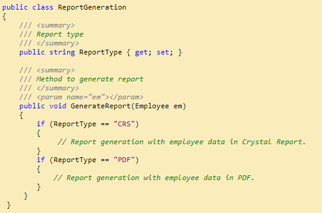

Brilliant!! Yes you are right, <b>too much ‘If’ clauses</b> are there and if we want to introduce another new report type like ‘Excel’, then you need to write another ‘if’.   <b> This class should be open for extension but closed for modification.</b> But how to do that!!

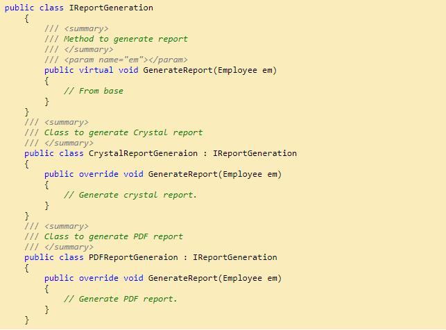

So if you want to introduce a new report type, then just <b>__inherit__</b> from <b>IReportGeneration.</b>   So <b>IReportGeneration</b> is <b><ins>open for extension</ins></b> but <b><ins>closed for modification.</ins></b>

<h2>2.3 Liskov substitution principle (LSP)</h2>

This principle is simple but very important to understand. <b><ins>Child class should not break parent class’s type definition and behavior.</ins></b>
  Now what is the meaning of this!! Ok let me take the same <b>employee</b> example to make you understand this principle.  Check the below picture. <ins>Employee is a parent class</ins> and <b>Casual</b> and <b>Contractual</b> employee are the <ins>child classes</ins>, inhering from <b>employee</b> class.

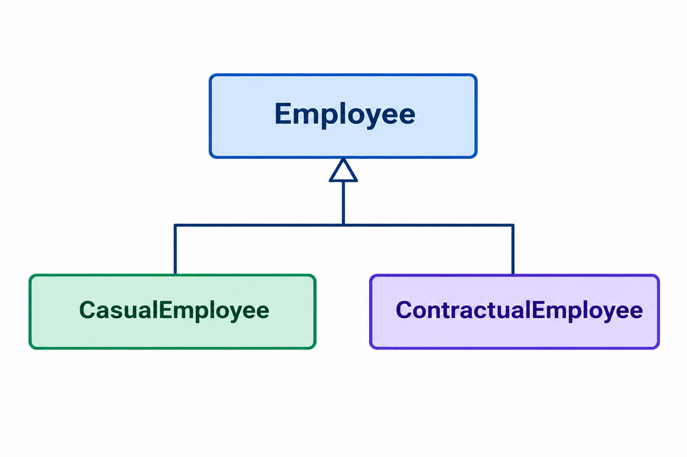
 
Now see the below code :
  
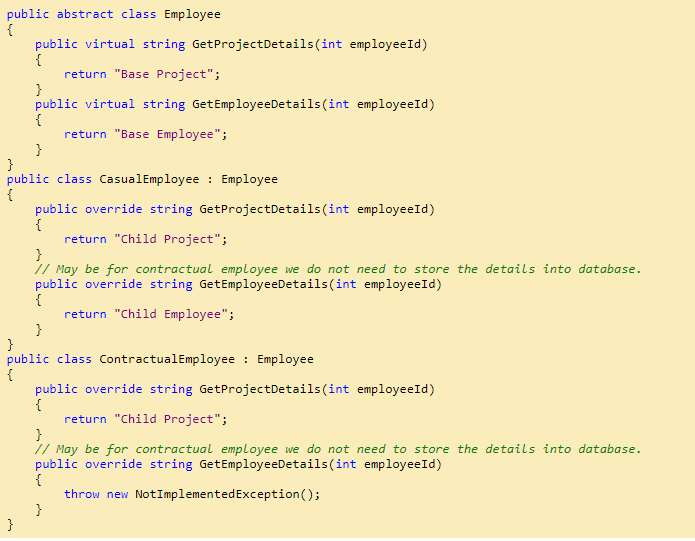
Up to this is fine right?
  Now, check the below code and it will <b>violate the LSP principle.</b>

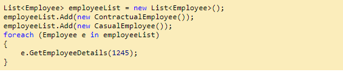
Now I guess you got the problem.  Yes right, for <b>contractual employee,</b> you will get not implemented exception and that is violating LSP.  Then what is the solution?  <b>Break the whole thing in 2 different interfaces,</b>  1. IProject  2. IEmployee   and implement according to employee type.
  
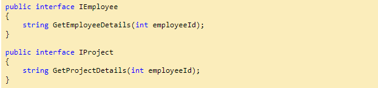

<h2>2.4 Interface segregation principle (ISP)</h2>

This principle states that <b>any client should not be forced to use an interface which is irrelevant to it.</b>  Now what does this mean, suppose there is one database for storing data of all types of employees (i.e. Permanent, non-permanent),    what will be the best approach for our interface?

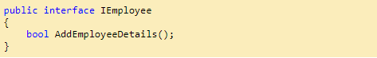
And all types of employee class will inherit this interface for saving data. This is fine right? Now suppose that company one day told to you that they want to read only data of permanent employees. What you will do, just add one method to this interface?  
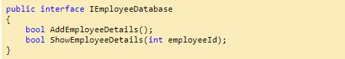
But now we are breaking something. We are forcing <b><ins>non-permanent employee</b></ins> class to show their details from database.   So, the solution is to <b><ins>give this responsibility to another interface.</b></ins>
 
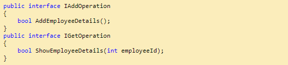
And <b>non-permanent</b> employee will implement <b>only IAddOperation</b> and <b>permanent employee</b> will implement <b>both the interface.</b>

<h2>2.5 Dependency inversion principle (DIP)</h2>

This principle tells <b><ins>you not to write any tightly coupled code because that is a nightmare to maintain when the application is growing bigger and bigger.</ins></b> If a class depends on another class, then we need to change one class if something changes in that dependent class.   <b><ins>We should always try to write loosely coupled class.</ins></b>

Suppose there is one notification system after saving some details into database.

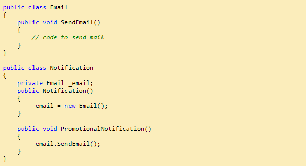

Now <b>Notification class</b> totally depends on <b>Email class,</b> because it only sends one type of notification.   If we want to introduce any other like SMS then? We need to <b>change</b> the notification system also. And this is called <b>tightly coupled.</b>
  What can we do to make it loosely coupled?
 Ok, check the following implementation.  
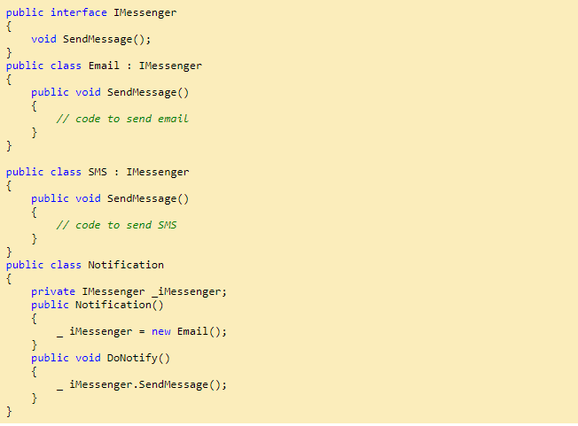

Still Notification class depends on Email class. Now, we can use <b><ins>dependency injection</ins></b> so that we can make it loosely coupled.   There are 3 types to DI, Constructor injection, Property injection and method injection.

<b>Constructor Injection</b> 
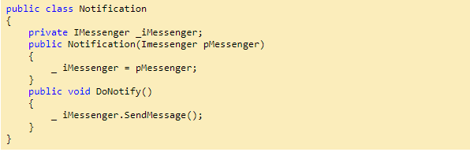

<b>Property Injection</b> 
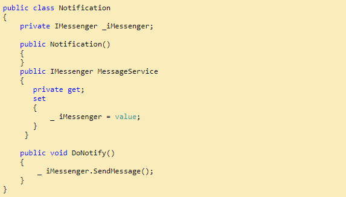

<b>Method Injection</b> 
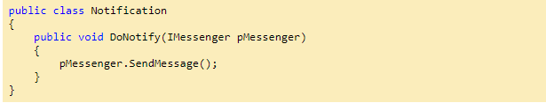

  SOLID principle will help us to write <b>loosely coupled code</b> which is <b>highly maintainable</b> and less error prone.
