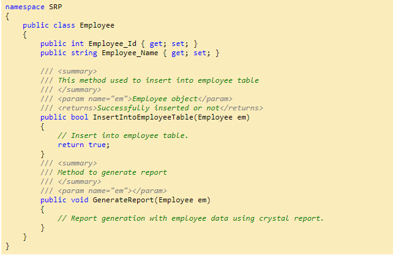
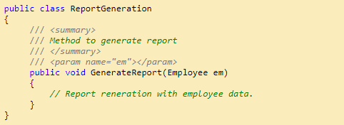

SOLID is basically 5 principles, which will help to create a good software architecture.  
You can see that all design patterns are based on these principles. SOLID is basically an acronym of the following:

* **S** is single responsibility principle (SRP)
* **O** stands for open closed principle (OCP)
* **L** Liskov substitution principle (LSP)
* **I** interface segregation principle (ISP)
* **D** Dependency injection principle (DIP)

<h2>1.1 Single responsibility principle (SRP)</h2>

A class should take one responsibility and there should be one reason to change that class. Now what does that mean? I want to share one picture to give a clear idea about this.

Now see this tool is a combination of so many different tools like knife, nail cutter, screw driver, etc. So will you want to buy this tool?  
I don’t think so. Because there is a problem with this tool, if you want to add any other tool to it, then you need to change the base and that is not good.  
This is a bad architecture to introduce into any system. It will be better if nail cutter can only be used to cut the nail or knife can only be used to cut vegetables.

<b>'Employee'</b> class is taking 2 responsibilities, one is to take responsibility of employee database operation and another one is to generate employee report.    <b>Employee</b> class should not take the report generation responsibility because suppose some days after your customer asked you to give a facility to generate the report in Excel or any other reporting format, then this class will need to be changed and that is not good.

So according to SRP, <b><ins>one class should take one responsibility</ins></b> so we should write one <ins>different class</ins> for report generation, so that any change in report generation should not affect the ‘Employee’ class.

<h2>2.2 Open closed principle (OCP)</h2>

Now take the same <b>‘ReportGeneration’</b> class as an example of this principle. Can you guess what is the problem with the below class!!

Brilliant!! Yes you are right, <b>too much ‘If’ clauses</b> are there and if we want to introduce another new report type like ‘Excel’, then you need to write another ‘if’.   <b> This class should be open for extension but closed for modification.</b> But how to do that!!

So if you want to introduce a new report type, then just <b>__inherit__</b> from <b>IReportGeneration.</b>   So <b>IReportGeneration</b> is <b><ins>open for extension</ins></b> but <b><ins>closed for modification.</ins></b>
